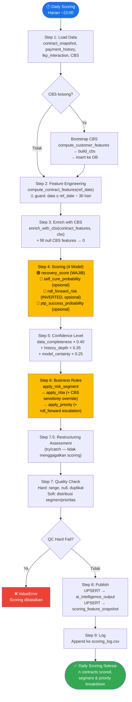
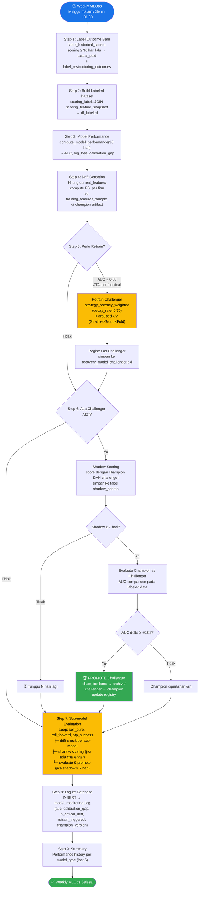
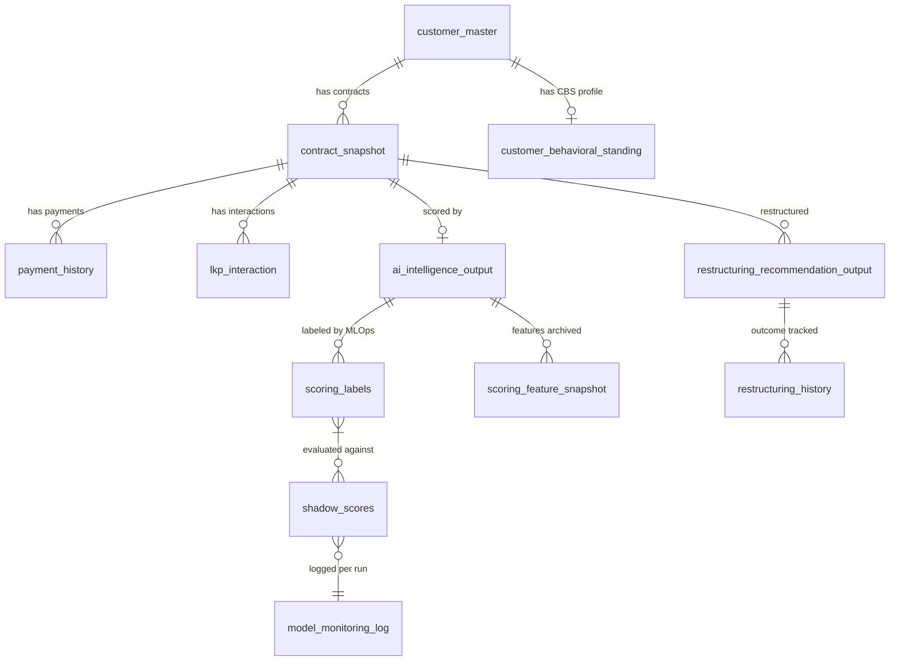

# Analisis Business Rules & Operational Flow — CollectAI Machine Learning

## 1. Ringkasan Sistem

CollectAI ML adalah pipeline **scoring dan MLOps untuk penagihan kredit** yang memprediksi kemungkinan nasabah menunggak akan membayar, menentukan segmen risiko, memberikan rekomendasi Next Best Action (NBA), dan menghasilkan tawaran restrukturisasi.

---

## 2. Business Rules

### 2.1 Risk Segmentation Rules
> File: [business_rules.py](file:///Users/mcdmobiledev11/Development/MCD/collect-ai/app/machine-learning/src/business_rules.py#L30-L66)

Nasabah dikategorikan ke 4 segmen berdasarkan **kombinasi skor model + perilaku historis**:

| Segmen | Kondisi | Makna |
|---|---|---|
| **Won't Pay** | `recovery_score < 0.30` **DAN** (`rejection_count ≥ 2` **ATAU** `last_result_code_encoded ≤ 1`) | Nasabah cenderung **menolak bayar** — bukan tidak mampu |
| **Cannot Pay** | `recovery_score ∈ [0.30, 0.50)` **DAN** (`broken_ptp > 0` **ATAU** `income_debt_ratio > 2.0`) | Nasabah **tidak mampu bayar** — PTP sering ingkar atau rasio utang tinggi |
| **Self-cure** | `recovery_score ≥ 0.70` **DAN** `dpd ≤ 7` **DAN** `payment_rate ≥ 0.80` **DAN** `self_cure_probability ≥ 0.70` | Nasabah kemungkinan besar **pulih sendiri** tanpa intervensi berat |
| **Can Pay** | Default (tidak memenuhi kriteria di atas) | Nasabah **mampu dan mau bayar** — potensi penagihan tinggi |

### 2.2 Next Best Action (NBA) Rules
> File: [business_rules.py](file:///Users/mcdmobiledev11/Development/MCD/collect-ai/app/machine-learning/src/business_rules.py#L69-L135)

Channel penagihan ditentukan melalui **matriks segmen × siklus** ditambah sejumlah override:

#### Base NBA Matrix

| Segmen | Cycle ≤ 1 | Cycle ≥ 2 |
|---|---|---|
| Self-cure | WA | WA |
| Can Pay | WA | Deskcoll |
| Cannot Pay | Deskcoll | Visit |
| Won't Pay | *(lihat OTS tier)* | *(lihat OTS tier)* |

#### Won't Pay NBA (berdasarkan OTS — Outstanding):

| Total OTS | NBA |
|---|---|
| `< 5 juta` | Visit |
| `≥ 5 juta` | Somasi |
| `≥ 20 juta` **DAN** `historical_default ≥ 2` | **Pickup** |

#### Channel Ranking (escalation only):
```
WA (1) → Deskcoll (2) → Visit (3) → Somasi (4) → Pickup (5)
```

#### NBA Override Rules (berurutan, yang terakhir menang):

| # | Override | Kondisi | Efek |
|---|---|---|---|
| 1 | **CBS Sensitivity** | `collection_sensitivity` dari CBS > NBA rank saat ini | **Upgrade** channel (tidak pernah downgrade) |
| 2 | **High Self-Cure** | `self_cure_probability ≥ 0.70` | Paksa ke **WA** (cukup reminder ringan) |
| 3 | **Low RPC Rate** | `rpc_rate < 0.30` **DAN** NBA rank saat ini < Visit | Eskalasi ke **Visit** (verifikasi alamat) |
| 4 | **Near Maturity** | `days_to_maturity < 60` **DAN** `ambc < 2× installment` | Turunkan ke **WA** (saldo kecil, segera lunas) |

### 2.3 Priority Level Rules
> File: [business_rules.py](file:///Users/mcdmobiledev11/Development/MCD/collect-ai/app/machine-learning/src/business_rules.py#L138-L183)

Prioritas ditentukan dari **matriks segmen × OTS tier** kemudian bisa di-eskalasi oleh roll forward risk:

#### Base Priority Matrix

| Segmen | OTS Low (<5jt) | OTS Mid (5–20jt) | OTS High (≥20jt) |
|---|---|---|---|
| Self-cure | Low | Low | Medium |
| Can Pay | Low | Medium | High |
| Cannot Pay | Medium | High | Critical |
| Won't Pay | High | Critical | Critical |

#### Roll Forward Risk Escalation:
Jika `roll_forward_risk ≥ 0.75`, prioritas **naik satu tingkat**:
- Low → Medium
- Medium → High
- High → Critical
- Critical → Critical (tetap)

### 2.4 CBS (Customer Behavioral Standing) Rules
> File: [cbs_builder.py](file:///Users/mcdmobiledev11/Development/MCD/collect-ai/app/machine-learning/src/cbs_builder.py#L40-L134)

#### Behavioral Grade (A–D):

| Grade | Composite Score | Makna |
|---|---|---|
| **A** | ≥ 0.80 | Perilaku sangat baik |
| **B** | ≥ 0.60 | Perilaku baik |
| **C** | ≥ 0.40 | Perilaku cukup / waspada |
| **D** | < 0.40 | Perilaku buruk |

#### Grade Override Rules:
- **Override ke C**: Grade A/B **tetapi** `self_cure_rate < 0.20`
- **Force to D**: jika salah satu dari:
  - `broken_ptp_count ≥ 5`
  - `historical_default_count ≥ 3`
  - `ptp_reliability_index < 0.10` **DAN** `sum_ptp_made ≥ 3`

#### B-List (Blacklist) Rules:
Nasabah masuk B-List jika **salah satu** terpenuhi:
- `behavioral_grade == "D"`
- `broken_ptp_count ≥ 3`
- `historical_default_count ≥ 3`
- `ptp_reliability_index < 0.10` **DAN** `ptp_made ≥ 3`
- `rpc_rate < 0.30`

> [!IMPORTANT]
> B-List status bersifat **sticky** — sekali `Y`, update_cbs() **mempertahankan** status `Y` yang sudah ada, tidak pernah di-reset.

#### Recovery Effort Level:
| Kondisi | Level |
|---|---|
| Grade D **ATAU** B-List=Y **ATAU** `active_contract ≥ 3` | **High** |
| Grade A | **Low** |
| Lainnya | **Mid** |

### 2.5 Confidence Level Rules
> File: [scoring_engine.py](file:///Users/mcdmobiledev11/Development/MCD/collect-ai/app/machine-learning/src/scoring_engine.py#L95-L124)

Confidence dihitung dari 3 komponen:
- **Data Completeness (40%)** — proporsi `CONF_KEY_FEATURES` yang tidak NULL
- **History Depth (35%)** — `payment_count` (clip 10) × 60% + `treatment_count` (clip 5) × 40%
- **Model Certainty (25%)** — `2 × |recovery_score − 0.5|` (semakin jauh dari 0.5, semakin pasti)

| Confidence Level | Kategori |
|---|---|
| ≥ 0.75 | **HIGH** |
| ≥ 0.50 | **MEDIUM** |
| < 0.50 | **LOW** |

### 2.6 Quality Check Rules
> File: [scoring_engine.py](file:///Users/mcdmobiledev11/Development/MCD/collect-ai/app/machine-learning/src/scoring_engine.py#L127-L231)

| Check | Threshold | Severity |
|---|---|---|
| Score range 0–1 | `recovery_score` & `confidence_level` ∈ [0, 1] | **Hard** (selalu gagal) |
| Kolom wajib not NULL | 7 kolom inti | **Hard** |
| Duplikat `contract_no` | Tidak boleh duplikat | **Hard** |
| Sub-score range 0–1 | `self_cure_prob`, `roll_forward_risk`, `ptp_success_prob` | **Hard** |
| Won't Pay ≤ 30% | Distribusi segmen | Soft (kecuali STRICT_QC=true) |
| Self-cure ≥ 3% | Distribusi segmen | Soft |
| Critical ≤ 20% | Distribusi prioritas | Soft |
| Self-cure prob consistency | Avg self_cure_prob di segmen Self-cure ≥ 0.50 | Soft |
| Won't Pay vs Self-cure RFR | Avg roll_forward_risk Won't Pay ≥ Self-cure | Soft |

### 2.7 Label / Outcome Rules
> File: [outcome_labeler.py](file:///Users/mcdmobiledev11/Development/MCD/collect-ai/app/machine-learning/src/outcome_labeler.py)

- **`actual_paid = 1`** jika ada pembayaran `Full` atau `Partial` dalam jendela **30 hari** setelah scoring_date
- **Semua 4 model menggunakan target yang sama** (`actual_paid`)
- Perbedaan antar model berasal dari **set fitur** dan **populasi training**, bukan target

### 2.8 Drift Detection & Retrain Rules
> File: [model_monitor.py](file:///Users/mcdmobiledev11/Development/MCD/collect-ai/app/machine-learning/src/model_monitor.py#L100-L141)

| PSI Value | Status |
|---|---|
| < 0.10 | **Stable** |
| 0.10 – 0.25 | **Warning** |
| > 0.25 | **Critical** |

**Trigger retrain** jika:
- `n_critical ≥ 2` (jumlah fitur PSI critical), **ATAU**
- `n_warning ≥ 5`, **ATAU**
- `AUC_live < 0.68`

### 2.9 Champion-Challenger Rules
> File: [champion_challenger.py](file:///Users/mcdmobiledev11/Development/MCD/collect-ai/app/machine-learning/src/champion_challenger.py#L87-L159)

| Kondisi | Keputusan |
|---|---|
| `AUC_delta ≥ +0.02` | **PROMOTE_CHALLENGER** |
| `AUC_delta ≤ -0.02` | KEEP_CHAMPION |
| `-0.02 < delta < +0.02` | NO_SIGNIFICANT_DIFF |
| Samples < 200 | INSUFFICIENT_DATA |
| Label variance < 2 | INSUFFICIENT_LABEL_VARIANCE |

- Shadow mode minimum: **7 hari** sebelum evaluasi
- Champion lama diarsipkan ke `models/archive/`

### 2.10 Restructuring Eligibility Rules
> File: [settings.py](file:///Users/mcdmobiledev11/Development/MCD/collect-ai/app/machine-learning/config/settings.py#L239-L289)

| Parameter | Nilai | Keterangan |
|---|---|---|
| Min DPD | 30 hari | Terlalu dini = belum layak |
| Max DPD | 180 hari | Terlalu lama = sudah masuk write-off |
| Max restrukturisasi/customer | 2× | Ke-3+ butuh approval komite |
| Max haircut bunga | 40% | Dari rate asal |
| Floor rate | 9% | ≈ cost of fund + margin |
| Max perpanjangan tenor | 24 bulan atau 50% sisa tenor | Ambil yang lebih ketat |
| Min pengurangan cicilan | 5% | Harus benar-benar meringankan nasabah |
| Max total pembayaran | 1.5× dari sekarang | Cegah lonjakan tidak proporsional |

---

## 3. Alur Operasi

### 3.1 Daily Scoring Flow

> File: [daily_scoring.py](file:///Users/mcdmobiledev11/Development/MCD/collect-ai/app/machine-learning/pipelines/daily_scoring.py)



### 3.2 Weekly MLOps Flow

> File: [weekly_mlops.py](file:///Users/mcdmobiledev11/Development/MCD/collect-ai/app/machine-learning/pipelines/weekly_mlops.py)



---

## 4. Relasi Antar Tabel



---

## 5. Ringkasan 4 Model XGBoost

| Model | Fitur | Populasi Training | Output | Wajib? |
|---|---|---|---|---|
| **recovery** | 36 fitur | Semua kontrak aktif | `recovery_score` ∈ [0,1] | ✅ Ya (hard fail tanpa ini) |
| **self_cure** | 12 fitur | Kontrak dengan DPD rendah | `self_cure_probability` ∈ [0,1] | ❌ Soft-degrade (NULL) |
| **roll_forward** | 14 fitur | Kontrak cycle ≥ 1 | `roll_forward_risk` ∈ [0,1] (**inverted**: P(tidak bayar)) | ❌ Soft-degrade (NULL) |
| **ptp_success** | 11 fitur | Kontrak pernah PTP | `ptp_success_probability` ∈ [0,1] | ❌ Soft-degrade (NULL) |

> [!WARNING]
> `roll_forward_risk` tersimpan dalam bentuk **terbalik** — nilainya P(*tidak* bayar), bukan P(bayar). Model ditraining untuk memprediksi P(bayar), kemudian hasilnya di-invert: `1.0 - pred`.

---

## 6. Threshold Kunci (dari [settings.py](file:///Users/mcdmobiledev11/Development/MCD/collect-ai/app/machine-learning/config/settings.py))

| Konstanta | Nilai | Dipakai Di |
|---|---|---|
| `SCORE_THRESHOLD_WONT_PAY` | 0.30 | Risk Segmentation |
| `SCORE_THRESHOLD_CANNOT_PAY` | 0.50 | Risk Segmentation |
| `SCORE_THRESHOLD_SELF_CURE` | 0.70 | Risk Segmentation |
| `SELF_CURE_PROB_THRESHOLD` | 0.70 | Risk Segmentation + NBA override |
| `ROLL_FORWARD_HIGH_RISK` | 0.75 | Priority escalation |
| `OTS_TIER_RENDAH` | 5 juta | NBA & Priority matrix |
| `OTS_TIER_TINGGI` | 20 juta | NBA & Priority matrix |
| `AUC_FLOOR` | 0.68 | Trigger retrain |
| `SHADOW_DAYS_MIN` | 7 hari | Evaluasi champion-challenger |
| `MIN_AUC_IMPROVEMENT` | 0.02 | Promote challenger |
| `LABEL_WINDOW_DAYS` | 30 hari | Labeling + feature cutoff |
| `RPC_RATE_LOW_THRESHOLD` | 0.30 | NBA override + B-List |
| `DAYS_TO_MATURITY_SHORT` | 60 hari | NBA override (near maturity) |
